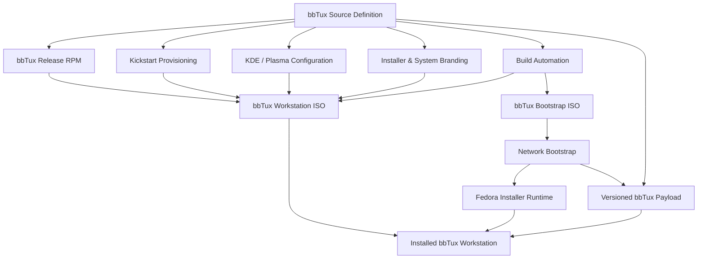
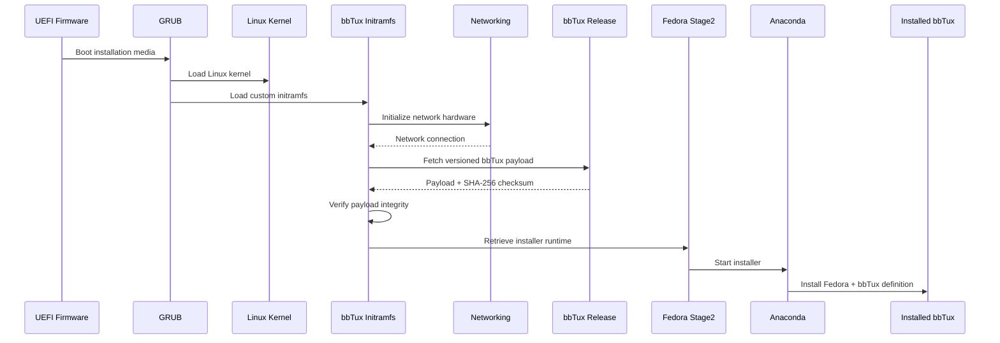
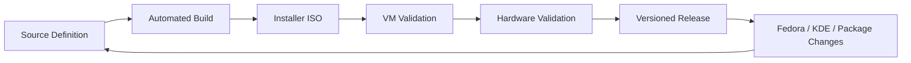
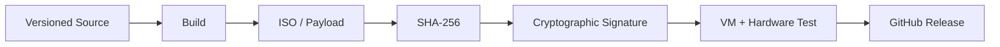
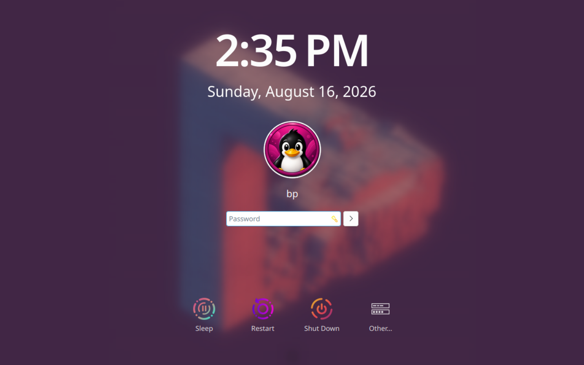
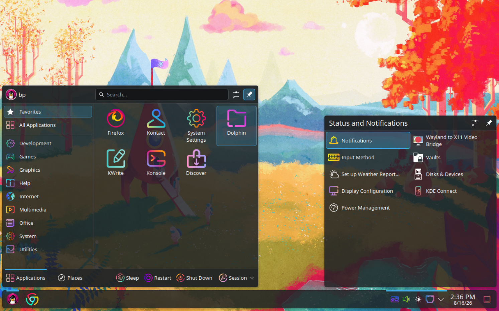
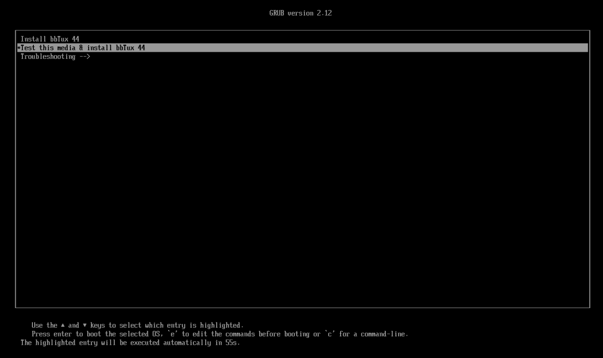
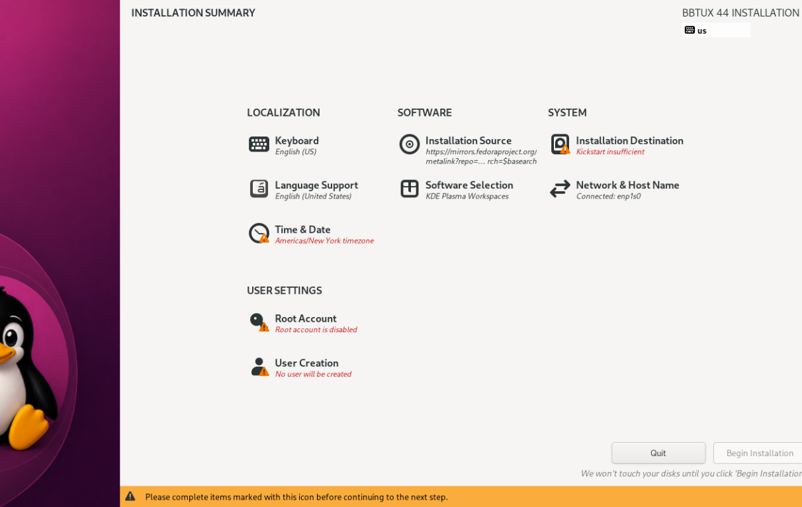

# bbTux

### Fedora-Based Linux Workstation, Installer Architecture & Release Engineering

**bbTux** is an independently maintained Fedora-based KDE Linux workstation built as a reproducible operating-system project rather than a customized machine image.

The project combines Linux system engineering, package management, installer construction, desktop integration, release engineering, UEFI boot infrastructure, and automated provisioning into a portable x86-64 workstation distribution.

> **Official source repository:**  
> https://github.com/psstpsst-ai/bbtux
>
> **Current release:**  
> https://github.com/psstpsst-ai/bbtux/releases/tag/bbtux-1.0.0

This repository is a **portfolio case study** describing the architecture and engineering work behind bbTux. The canonical source code, build history, releases, checksums, and installation artifacts are maintained in the official PSSTPSST repository above.

---

## Project Overview

bbTux began as an effort to turn a carefully configured Fedora KDE workstation into something reproducible, portable, and maintainable.

Instead of cloning a configured computer or preserving a one-off disk image, bbTux defines the workstation as source:

- package selection
- RPM packaging
- KDE and Plasma configuration
- installer behavior
- system identity
- desktop appearance
- boot infrastructure
- provisioning scripts
- release metadata
- build automation

The result is a Linux workstation that can be rebuilt from its source definition as Fedora, KDE, applications, packages, and configuration formats evolve.

The installer intentionally avoids preserving machine-specific or personal state such as Wi-Fi credentials, Bluetooth pairings, disk UUIDs, monitor identifiers, personal accounts, or device-specific configuration.

---

## Architecture



The architecture deliberately separates the **workstation definition** from the generated installation media.

The source definition is the durable artifact. Installer ISOs and payloads are versioned build products that can be regenerated as Fedora, KDE Plasma, applications, packages, and configuration formats evolve.

---

## Two Installer Models

bbTux currently uses two complementary installation architectures.

### Full Workstation ISO

The primary installer is a self-contained Fedora 44 KDE installation image customized for bbTux.

It includes:

- bbTux release identity and RPM packaging
- KDE Plasma workstation configuration
- Kickstart provisioning
- application selection
- Anaconda installer customization
- UEFI and GRUB boot support
- desktop and system branding
- post-install provisioning
- release metadata

The full Workstation ISO is the primary published installation method for bbTux 1.0.0.

### Lightweight Bootstrap

A second installation architecture is under active development.

The **bbTux Bootstrap** is a small bootable environment designed to contain only enough Linux infrastructure to:

1. boot ordinary x86-64 hardware
2. initialize networking
3. retrieve a versioned bbTux payload
4. verify that payload
5. retrieve the Fedora installer runtime
6. hand installation to Anaconda

The experimental Bootstrap is currently approximately **250 MB**, compared with the substantially larger full Workstation installer.

Its purpose is not merely to minimize file size. It explores the separation of the **boot environment**, **upstream installer runtime**, and **bbTux workstation definition**.

---

## Bootstrap Architecture



The Bootstrap uses a purpose-built **dracut initramfs** containing bbTux initialization logic, networking tools, selected kernel drivers and firmware, and the components required to reach the remote installation environment.

Development has included real-hardware debugging of UEFI boot paths, EFI System Partition behavior, GRUB configuration, kernel module loading, firmware initialization, NetworkManager behavior, and installer handoff.

---

## System Engineering

bbTux is more than a collection of desktop customizations.

The project crosses several layers of the Linux operating-system stack:

| Layer | bbTux Engineering |
|---|---|
| **UEFI** | Hybrid installation media and EFI System Partition handling |
| **GRUB** | Custom boot configuration and installer startup |
| **Linux Kernel** | Kernel selection, hardware modules and firmware |
| **initramfs / dracut** | Purpose-built early userspace for Bootstrap |
| **systemd** | Boot services, ordering and system integration |
| **NetworkManager** | Installation and Bootstrap networking |
| **RPM** | bbTux release identity and package-based integration |
| **DNF** | Fedora and local repository package resolution |
| **Kickstart** | Reproducible workstation provisioning |
| **Anaconda** | Installer integration and bbTux presentation |
| **KDE Plasma** | Desktop, login, lock screen and workspace behavior |
| **xorriso** | Reproducible hybrid ISO construction |
| **Git / GitHub** | Source history, versioning and release publication |

This is the part of the project I find most interesting: each layer must agree with the others.

A bootloader configuration, kernel command line, initramfs service, package definition, installer configuration, and desktop environment may each work independently while still failing as a complete installation system.

bbTux therefore treats the workstation as an integrated system rather than a collection of individually configured components.

---

## Reproducible Build Model

A central design principle is:

> **The repository is the product definition. The ISO is a disposable snapshot.**



When Fedora, KDE Plasma, third-party applications, package names, or configuration formats change, the workstation definition can be updated incrementally.

A new installer is then built and validated.

There is no need to preserve an obsolete ISO as though it were the operating system itself.

---

## Hardware Portability

bbTux is intended to be a **portable modern x86-64 workstation**, not an image of one particular computer.

The build deliberately avoids embedding personal or hardware-specific state such as:

- Wi-Fi credentials
- Bluetooth pairings
- monitor identifiers
- machine IDs
- disk UUIDs
- personal accounts
- device-specific display layouts
- local user data

The goal is for the same workstation definition to install across ordinary Intel and AMD desktop and laptop hardware.

Real-hardware development has included Lenovo systems in addition to virtual-machine testing.

---

## KDE Plasma Integration

bbTux uses **KDE Plasma on Wayland** and treats desktop behavior as part of the operating-system definition.

The workstation definition includes areas such as:

- Plasma configuration
- application selection
- icon and cursor themes
- desktop wallpaper
- animated login and lock-screen presentation
- KWin behavior and effects
- workstation identity
- installer presentation
- application provisioning

The objective is not to restore a backed-up user profile.

It is to make a **fresh installation behave like bbTux** while remaining free of the originating user's personal state.

---

## Installer Engineering

The installer is built on Fedora's Anaconda ecosystem while replacing or extending the pieces necessary to present and provision bbTux.

Engineering work has included:

- Kickstart construction
- custom package repositories
- bbTux release RPM creation
- installer CSS and visual identity
- hostname and operating-system identity
- UEFI and GRUB configuration
- EFI boot-image modification
- Anaconda updates images
- post-install provisioning
- VM and physical-hardware validation

The installation path is therefore built and tested as part of the project rather than documented as a list of manual configuration steps.

---

## Release Engineering

bbTux uses its own semantic versioning independently of the Fedora release on which it is based.

For example:

```text
bbTux 1.0.0
Fedora 44
KDE
x86-64
```

The current Workstation installer follows the naming convention:

```text
bbTux-1.0.0-F44-KDE-x86_64.iso
```

This separates two different concepts:

**bbTux project version**

```text
1.0.0
1.0.1
1.1.0
2.0.0
```

**Upstream Fedora base**

```text
Fedora 44
Fedora 45
...
```

That allows bbTux to evolve on its own schedule while still making its upstream foundation explicit.

---

## Release Integrity

Published installation media is accompanied by SHA-256 checksums and cryptographic signing material.

The release process is designed around:



This provides both a reproducible development history and independently verifiable release artifacts.

---

## bbTux 1.0.0

The first public release is based on **Fedora 44 KDE**.

The full Workstation ISO has been:

- built from the bbTux source definition
- tested in virtual machines
- installed on physical hardware
- versioned as bbTux 1.0.0
- checksummed
- cryptographically signed
- published through GitHub Releases

### [Download bbTux 1.0.0](https://github.com/psstpsst-ai/bbtux/releases/tag/bbtux-1.0.0)

---

## Bootstrap Development

The Bootstrap installer remains **experimental and under active hardware validation**.

Current work includes:

- custom dracut initramfs construction
- UEFI boot behavior
- EFI System Partition manipulation
- GRUB configuration
- portable network-driver support
- wireless firmware loading
- early-boot NetworkManager behavior
- remote payload retrieval
- SHA-256 payload verification
- Fedora Stage2 retrieval
- Anaconda handoff

The Bootstrap is intentionally being tested on physical hardware rather than being considered complete simply because it works in a virtual machine.

That distinction has already exposed differences between virtual UEFI behavior and real firmware implementations and has driven several improvements to the build architecture.

---

## Screenshots

### bbTux Login



### bbTux Desktop



### bbTux Bootstrap Installer



### bbTux Installer



---

## What This Project Demonstrates

bbTux is primarily a **systems-engineering and architecture project**.

It demonstrates work across boundaries that are frequently treated as separate specialties:

```text
Linux
  ↓
UEFI / GRUB
  ↓
Kernel / Firmware
  ↓
initramfs / systemd
  ↓
Networking
  ↓
RPM / DNF
  ↓
Anaconda / Kickstart
  ↓
KDE Plasma
  ↓
Build & Release Engineering
```

The interesting problem is not simply creating a Linux desktop with a particular appearance.

It is making that workstation:

**defined · reproducible · portable · installable · versioned · verifiable · maintainable**

---

## Source Code & Build History

This repository is the portfolio presentation for bbTux.

The actual engineering repository — including source code, build scripts, configuration, Git history, packaging, and releases — is maintained by PSSTPSST:

### **[View the bbTux source repository →](https://github.com/psstpsst-ai/bbtux)**

### **[View the bbTux 1.0.0 release →](https://github.com/psstpsst-ai/bbtux/releases/tag/bbtux-1.0.0)**

The portfolio repository intentionally does not duplicate the complete source tree.

---

## Project Links

| | |
|---|---|
| **Portfolio Case Study** | [thepocock/bbTux](https://github.com/thepocock/bbTux) |
| **Official Source** | [psstpsst-ai/bbtux](https://github.com/psstpsst-ai/bbtux) |
| **Current Release** | [bbTux 1.0.0](https://github.com/psstpsst-ai/bbtux/releases/tag/bbtux-1.0.0) |

---

*bbTux is independently maintained and is not Fedora Linux. Fedora is a trademark of Red Hat, Inc.*
